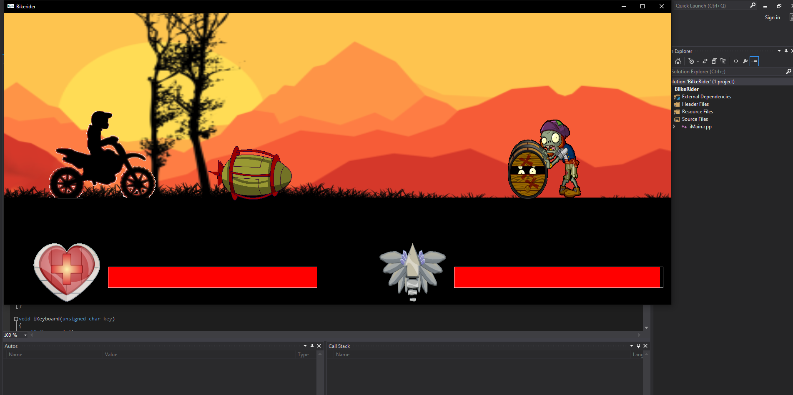
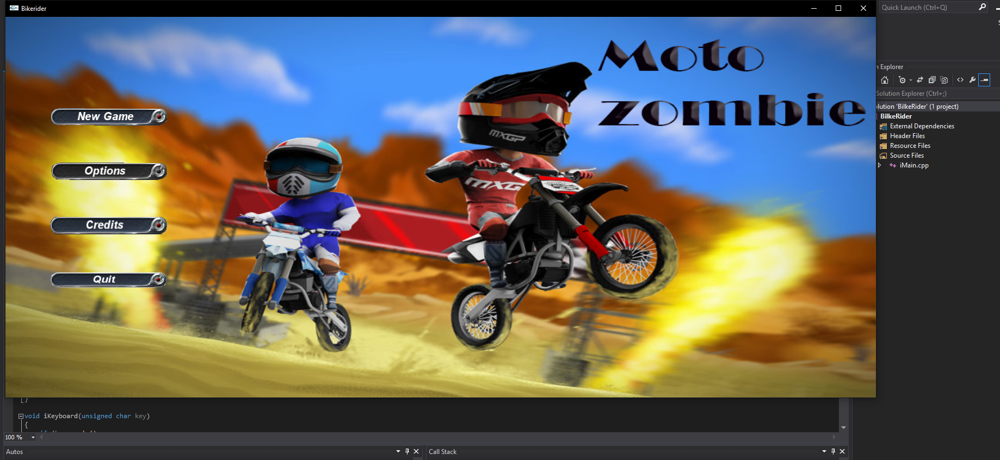
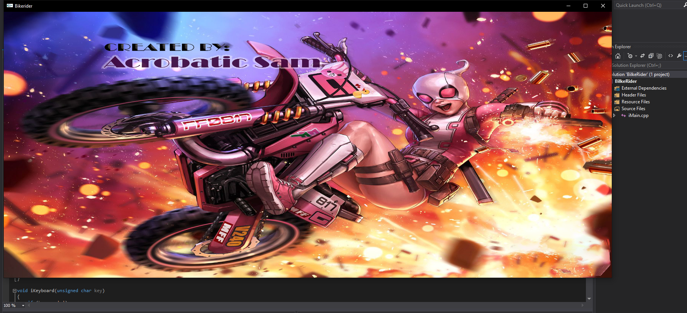
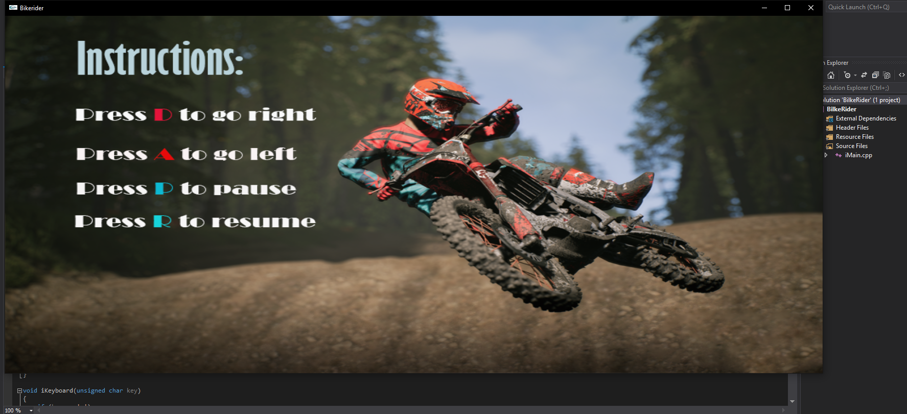

# MotoZombies
This repository contains a mini game created using Igraphics.h and visual studio
IDE: Visual studio ultimate 13,codeblocks
Language: C,C++;
Game Description: This is mini game containing one player character and one enemy character ,player chaarcter is the boy riding a bike and enemy character is the xpmbie ,you have to hit the zombie with  fire barrel to kill the  zombie ,booth the zombie and you hae health bars, if the zombie crosses you you will lose some health, and if you hit it then zombie will reduce health

Screenshots:

